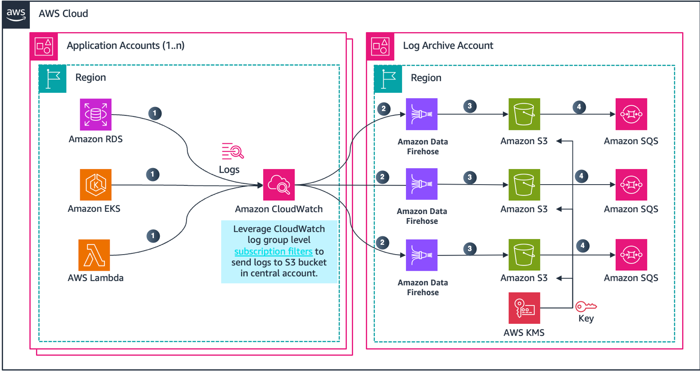

// Copyright Amazon.com, Inc. or its affiliates. All Rights Reserved.

// SPDX-License-Identifier: MIT-0

# AWS Centralized Logging Architecture

## Introduction

This solution provides a comprehensive framework for implementing centralized logging across multiple AWS accounts. It enables automated collection and management of logs from various AWS services (RDS, EKS, and Lambda) through CloudWatch Logs to a dedicated Log Archive account. The solution includes secure cross-account log collection, centralized storage, and automated log processing capabilities.

## Architecture

The solution consists of two main components:

1. **Application Accounts (1..n)**
   - Sources logs from:
     - Amazon RDS
     - Amazon EKS
     - AWS Lambda
   - Uses CloudWatch Logs with subscription filters
   - Leverages CloudWatch log group level filters to send logs to S3 bucket in central account

2. **Log Archive Account**
   - Receives logs through:
     - Amazon Kinesis Data Firehose
     - Amazon S3 (central storage)
     - Amazon SQS (for further processing)
   - Implements KMS encryption for security
   - Manages cross-account access controls

## AWS Services Used

- **Amazon CloudWatch Logs** - [Amazon CloudWatch Logs](https://docs.aws.amazon.com/AmazonCloudWatch/latest/logs/WhatIsCloudWatchLogs.html) is a centralized service for collecting, storing, and analyzing log files from various AWS resources. In this solution, it serves as the primary collector for logs from RDS, EKS, and Lambda services.

- **CloudWatch Logs Subscription Filters** - [CloudWatch Logs Subscription Filters](https://docs.aws.amazon.com/AmazonCloudWatch/latest/logs/SubscriptionFilters.html) enable real-time streaming of log data from CloudWatch Logs to other services. In this solution, they're used to filter and route specific log events to Kinesis Data Firehose for centralized processing and storage.

- **Amazon Data Firehose** - [Amazon Data Firehose](https://docs.aws.amazon.com/firehose/latest/dev/what-is-this-service.html) is a fully managed service for delivering real-time streaming data. Here, it's used to reliably stream logs from CloudWatch Logs to the central S3 bucket in the log archive account.

- **Amazon S3** - [Amazon Simple Storage Service (S3)](https://docs.aws.amazon.com/AmazonS3/latest/userguide/Welcome.html) provides secure, durable, and scalable object storage. In this architecture, it serves as the central repository for long-term log storage and archival.

- **Amazon SQS** - [Amazon Simple Queue Service (SQS)](https://docs.aws.amazon.com/AWSSimpleQueueService/latest/SQSDeveloperGuide/welcome.html) is a fully managed message queuing service. It's used for buffering and processing log messages, ensuring reliable log delivery even during high volume periods.

- **AWS KMS** - [AWS Key Management Service (KMS)](https://docs.aws.amazon.com/kms/latest/developerguide/overview.html) manages encryption keys for securing logs both in transit and at rest, providing an additional layer of security for sensitive log data.

- **Amazon EKS** - [Amazon Elastic Kubernetes Service (EKS)](https://docs.aws.amazon.com/eks/latest/userguide/what-is-eks.html) is a managed Kubernetes service. The solution captures and centralizes container logs, control plane logs, and application logs from EKS clusters.

- **Amazon RDS** - [Amazon Relational Database Service (RDS)](https://docs.aws.amazon.com/AmazonRDS/latest/UserGuide/Welcome.html) is a managed relational database service. The solution collects various database logs including error logs, audit logs, and slow query logs.

- **AWS Lambda** - [AWS Lambda](https://docs.aws.amazon.com/lambda/latest/dg/welcome.html) is a serverless compute service. The solution captures Lambda function execution logs, errors, and custom application logs.

- **AWS IAM** - [AWS Identity and Access Management (IAM)](https://docs.aws.amazon.com/IAM/latest/UserGuide/introduction.html) manages access control and permissions. It's crucial for setting up cross-account access and defining fine-grained permissions for log management.

- **Amazon VPC** - [Amazon Virtual Private Cloud (VPC)](https://docs.aws.amazon.com/vpc/latest/userguide/what-is-amazon-vpc.html) provides network isolation. The solution uses VPC endpoints for secure communication between services within the AWS network.

## Repository Structure

```
.
├── Application_account/           # Application account configurations
│   ├── modules/
│   │   ├── eks/                  # EKS logging module
│   │   ├── lambda/              # Lambda logging module
│   │   └── rds/                 # RDS logging module
│   └── [Terraform files]
├── Log_archive_account/          # Log archive account configurations
│   ├── modules/
│   │   └── log_destination/     # Central logging infrastructure
│   └── [Terraform files]
└── README.md
```

## Pre-requisites

1. Install and use latest [Terraform CLI](https://developer.hashicorp.com/terraform/tutorials/aws-get-started/install-cli)
2. Multiple AWS accounts (minimum 2: application and log archive)
   - Accounts must be provisioned through [AWS Control Tower](https://docs.aws.amazon.com/controltower/latest/userguide/what-is-control-tower.html) and [Account Factory for Terraform (AFT)](https://docs.aws.amazon.com/controltower/latest/userguide/aft-getting-started.html)
   - Follow [AFT Account Request](https://docs.aws.amazon.com/controltower/latest/userguide/aft-account-request.html) process for new accounts
   - Ensure [AFT Account Customizations](https://docs.aws.amazon.com/controltower/latest/userguide/aft-account-customization.html) are properly configured
3. [AWS CLI V2](https://docs.aws.amazon.com/cli/latest/userguide/getting-started-install.html) version
4. Appropriate [IAM permissions for cross-account access](https://docs.aws.amazon.com/IAM/latest/UserGuide/tutorial_cross-account-with-roles.html)
5. Latest [AWS provider versions](https://registry.terraform.io/providers/hashicorp/aws/latest/docs)
6. Configured [VPC endpoints](https://docs.aws.amazon.com/vpc/latest/privatelink/vpc-endpoints.html) for secure service access
7. [KMS keys](https://docs.aws.amazon.com/kms/latest/developerguide/overview.html) for encryption
8. A regulated VPC following [AWS Well-Architected Framework](https://docs.aws.amazon.com/wellarchitected/latest/framework/welcome.html) best practices
9. Proper [networking setup](https://docs.aws.amazon.com/vpc/latest/userguide/VPC_Networking.html) for cross-account communication

## Software Requirements

| Name | Version |
|------|---------|
| terraform | >= 1.5.0 |
| aws | ~> 5.69.0 |
| external | 2.3.3 |
| random | 3.6.2 |

## Deployment Instructions

1. Clone this repository:
```bash
git clone git@ssh.gitlab.aws.dev:drbyash/centralised-logging-at-enterprise-scale-using-terraform.git
cd aws-centralized-logging
```

2. Navigate to Log Archive account directory:
```bash
cd Log_archive_account
```

3. Initialize terraform:
```bash
terraform init
```

4. Review planned changes:
```bash
terraform plan
```

5. Apply the configuration:
```bash
terraform apply --auto-approve
```

6. Navigate to Application account directory:
```bash
cd ../Application_account
```

7. Repeat steps 3-5 for the Application account

## Infrastructure Cleanup
1. Empty all S3 buckets used for logging
2. Navigate to Application account directory:
```bash
cd Application_account
terraform destroy --auto-approve
```
3. Navigate to Log Archive account directory:
```bash
cd ../Log_archive_account
terraform destroy --auto-approve
```

## Modules

| Name | Source | Description |
|------|--------|-------------|
| eks_logging | ./modules/eks | EKS cluster logging configuration |
| lambda_logging | ./modules/lambda | Lambda function logging setup |
| rds_logging | ./modules/rds | RDS instance logging configuration |
| log_destination | ./modules/log_destination | Central logging infrastructure |

## Inputs

### Log Archive Account Variables

| Name | Description | Type | Default | Required |
|------|-------------|------|---------|:--------:|
| `environment` | Environment name for the log archive setup | `string` | n/a | yes |
| `destination_name` | Name of the central log destination | `string` | n/a | yes |
| `source_account_ids` | List of AWS account IDs allowed to put subscription filters | `list(string)` | `[]` | no |

### Application Account Variables

#### Core Settings
| Name | Description | Type | Default | Required |
|------|-------------|------|---------|:--------:|
| `environment` | Environment name (e.g., prod, dev, staging) | `string` | n/a | yes |
| `account_name` | Name of the AWS account | `string` | n/a | yes |
| `log_archive_account_id` | AWS account ID for log archiving | `string` | n/a | yes |
| `admin_role_name` | Name of the admin role | `string` | n/a | yes |

#### Network Configuration
| Name | Description | Type | Default | Required |
|------|-------------|------|---------|:--------:|
| `vpc_config` | VPC configuration object | `object` | n/a | yes |
| `restrictive_cidr_range` | Restrictive CIDR range for security groups | `list(string)` | n/a | yes |
| `ingress_allowed_cidr_blocks` | Allowed ingress CIDR blocks | `list(string)` | n/a | yes |
| `egress_allowed_cidr_blocks` | Allowed egress CIDR blocks | `list(string)` | n/a | yes |

```hcl
vpc_config = {
  vpc_cidr        = "10.0.0.0/16"
  private_subnets = ["10.0.1.0/24", "10.0.2.0/24"]
  public_subnets  = ["10.0.3.0/24", "10.0.4.0/24"]
}
```

#### RDS Configuration
| Name | Description | Type | Default | Required |
|------|-------------|------|---------|:--------:|
| `rds_config` | RDS instance configuration | `object` | n/a | yes |
| `rds_parameters` | RDS parameter group settings | `object` | n/a | yes |

```hcl
rds_config = {
  identifier        = "db-instance"
  allocated_storage = 20
  storage_type      = "gp2"
  engine            = "mysql"
  engine_version    = "8.0"
  instance_class    = "db.t3.medium"
  username          = "admin"
}


rds_parameters = {
  general_log     = 1
  slow_query_log  = 1
  long_query_time = 10
  log_output      = "FILE"
}
```

#### EKS Configuration
| Name | Description | Type | Default | Required |
|------|-------------|------|---------|:--------:|
| `eks_config` | EKS cluster configuration | `object` | n/a | yes |

```hcl
eks_config = {
  cluster_name  = "my-eks"
  eks_version   = "1.27"
  fargate_profiles = {
    default = {
      name = "default"
      selectors = [
        {
          namespace = "default"
        }
      ]
    }
  }
}
```

#### Lambda Configuration
| Name | Description | Type | Default | Required |
|------|-------------|------|---------|:--------:|
| `lambda_config` | Lambda function configuration | `object` | n/a | yes |

```hcl
lambda_config = {
  runtime     = "python3.9"
  timeout     = 30
  memory_size = 128
}
```

#### Tags
| Name | Description | Type | Default | Required |
|------|-------------|------|---------|:--------:|
| `tags` | Common tags to be applied to all resources | `map(string)` | n/a | yes |

```hcl
tags = {
  Environment = "production"
  Project     = "centralized-logging"
  Owner       = "platform-team"
}
```

## Outputs

| Name | Description |
|------|-------------|
| `eks_log_group_arn` | EKS CloudWatch Log Group ARN |
| `lambda_log_group_arn` | Lambda CloudWatch Log Group ARN |
| `rds_log_group_arn` | RDS CloudWatch Log Group ARN |
| `central_logging_bucket` | Central S3 bucket for log storage |
| `kinesis_firehose_arn` | Kinesis Firehose delivery stream ARN |
| `sqs_queue_arn` | SQS queue ARN for log processing |
| `vpc_endpoint_ids` | List of created VPC endpoint IDs |
| `cloudwatch_log_role_arn` | IAM role ARN for CloudWatch Logs |
| `kms_key_arn` | KMS key ARN for encryption |

## Security Features

### Encryption
- KMS encryption for CloudWatch Log Groups
- S3 bucket encryption for log storage
- Cross-account encryption for data in transit
- Encrypted RDS audit logs

### Access Control
- IAM roles with least privilege
- Cross-account IAM roles
- S3 bucket policies

### Network Security
- Security group restrictions
- Private subnet deployment
- Network ACL rules

### Monitoring
- CloudWatch Logs monitoring
- CloudTrail integration

## Best Practices

### Security
- Regular rotation of KMS keys
- Periodic IAM permission reviews
- Security group rule audits
- Encryption in transit and at rest

### Performance
- Monitor CloudWatch Logs throughput
- Optimize log retention periods
- Configure proper log filters
- Implement S3 lifecycle policies

### Cost Management
- Monitor log storage usage
- Set up cost allocation tags
- Configure retention periods
- Use S3 lifecycle rules

### Maintenance
- Regular logging pattern reviews
- Monitor filter performance
- Check delivery failures
- Update configurations

## Troubleshooting

### Common Issues

1. **Log Delivery Failures**
```bash
aws cloudwatch get-metric-statistics \
    --namespace AWS/Logs \
    --metric-name DeliveryErrors
```

2. **Permission Issues**
```bash
aws iam simulate-principal-policy \
    --policy-source-arn <role-arn> \
    --action-names logs:PutSubscriptionFilter
```

3. **Encryption Issues**
```bash
aws kms get-key-policy \
    --key-id <key-id> \
    --policy-name default
```
